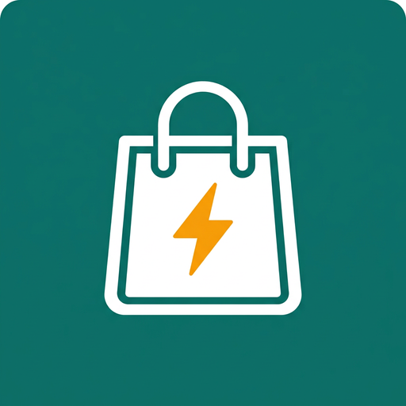

<p align="center">
  
</p>

<h1 align="center">BozorGo</h1>
<p align="center"><b>O'zbekiston bozori uchun zamonaviy marketplace ilovasi (Android)</b></p>
<p align="center">
  <a href="../../actions/workflows/build-apk.yml"></a>
  
  
  
</p>

---

## 📱 Loyiha haqida

**BozorGo** — Uzum Market kabi funksionallikka ega, lekin o'ziga xos dizayn, brending va
interfeysga ega bo'lgan to'liq ishlaydigan marketplace ilovasining MVP versiyasi.

Ilova hozirda **DEMO rejimida** ishlaydi: 57 ta mahsulot, 14 ta kategoriya, sharhlar va bannerlar
lokal ma'lumotlardan yuklanadi; savat, sevimlilar, buyurtmalar va profil qurilmada saqlanadi.
Arxitektura keyinchalik REST API yoki Firebase ulashga tayyor.

### Asosiy imkoniyatlar

| Bo'lim | Nima ishlaydi |
|---|---|
| **Bosh sahifa** | Logo, qidiruv, banner karuseli (avtoplay), kategoriyalar, «Mashhur», «Siz uchun», «Chegirmalar», «Yangi», «Eng ko'p sotilganlar» |
| **Kategoriyalar** | 14 ta kategoriya, sub-kategoriya chiplari, kategoriya bo'yicha mahsulotlar |
| **Qidiruv** | Sinonimli qidiruv (`telefon`, `olma`, `televizor`, `erkaklar kiyimi`…), tarix, mashhur qidiruvlar, debounce |
| **Filtr** | Narx oralig'i, kategoriya, reyting, brend, chegirma, mavjudlik |
| **Saralash** | Arzon→qimmat, qimmat→arzon, reyting, yangilari, mashhurligi |
| **Mahsulot** | Rasm karuseli + zoom, narx/chegirma, xususiyatlar, yetkazish, sotuvchi, sharhlar, o'xshash mahsulotlar, miqdor, «Savatga», «Hozir sotib olish», wishlist |
| **Savat** | Miqdor +/−, o'chirish (swipe ham), checkbox tanlash, chegirma va yetkazib berish hisobi, bepul yetkazish chegarasi |
| **Checkout** | 4 bosqich: manzil → telefon → to'lov → tasdiqlash. Naqd / karta / onlayn (DEMO PAYMENT) |
| **Buyurtmalar** | Statuslar (kutilmoqda, tayyorlanmoqda, yo'lda, yetkazildi, bekor qilingan), timeline, bekor qilish, qayta buyurtma |
| **Sevimlilar** | Yurak animatsiyasi, alohida sahifa, «hammasini savatga» |
| **Profil** | Avatar, ism/telefon/email tahriri, manzillar CRUD, sozlamalar, bildirishnomalar, til, dark/light, yordam (FAQ), ilova haqida, chiqish |
| **Holatlar** | Har joyda loading (shimmer), empty va error ekranlari |
| **Dizayn** | Light rejim asosiy, Dark rejim to'liq tayyor; Manrope shrifti; responsive grid (2–5 ustun) |

## 🛠 Texnologiyalar

- **Flutter 3.35 / Dart 3.9** — Android uchun zamonaviy va barqaror UI framework
- **flutter_riverpod 2.x** — state management (Notifier / AsyncNotifier)
- **go_router 14** — deklarativ navigatsiya, `StatefulShellRoute` bilan 5 tabli bottom navigation
- **shared_preferences** — lokal saqlash (savat, sevimlilar, buyurtmalar, profil, sozlamalar)
- **cached_network_image** — tarmoq rasmlari uchun (backend ulanganda)
- **Material 3** + maxsus `ThemeExtension`
- **GitHub Actions** — avtomatik analyze, test va APK build

## 🚀 Loyihani ishga tushirish

### Talablar
- Flutter SDK **3.35+** (`flutter --version`)
- Android SDK (API 24+), JDK 17
- Android qurilma yoki emulator

```bash
git clone <repo-url>
cd bozorgo
flutter pub get
flutter run
```

### Tekshirish
```bash
flutter analyze
flutter test
```

## 📦 APK build

### Development (debug) APK
```bash
flutter build apk --debug
# natija: build/app/outputs/flutter-apk/app-debug.apk
```

### Release APK
```bash
flutter build apk --release
# natija: build/app/outputs/flutter-apk/app-release.apk

# ABI bo'yicha kichikroq APKlar (arm64-v8a, armeabi-v7a, x86_64):
flutter build apk --release --split-per-abi
```

> **Imzolash.** `android/key.properties` mavjud bo'lmasa, release APK **debug kalit** bilan imzolanadi
> (test qilish uchun yaroqli, Play Market uchun emas). Haqiqiy imzolash uchun:
>
> ```bash
> keytool -genkey -v -keystore android/app/release.jks -keyalg RSA -keysize 2048 -validity 10000 -alias bozorgo
> ```
> so'ng `android/key.properties`:
> ```properties
> storeFile=release.jks
> storePassword=***
> keyAlias=bozorgo
> keyPassword=***
> ```
> Bu fayllar `.gitignore` da — repoga tushmaydi.

## ⚙️ GitHub Actions orqali APK olish

Workflow: [`.github/workflows/build-apk.yml`](.github/workflows/build-apk.yml)

**Qachon ishlaydi:** `main` va `arena/**` branchlarga push, `main` ga pull request, `v*` teglar va qo'lda (`workflow_dispatch`).

**Qadamlar:**
1. GitHub → **Actions** → **Build Android APK** → **Run workflow** (yoki oddiy push qiling).
2. `analyze-test` job: `flutter analyze` + `flutter test`.
3. `build` job: debug va release APK yig'iladi.
4. Tugagach, run sahifasining pastida **Artifacts** bo'limidan yuklab oling:
   - `BozorGo-debug-apk` → `BozorGo-v1.0.0-debug.apk`
   - `BozorGo-release-apk` → `BozorGo-v1.0.0-release.apk` + ABI bo'yicha variantlar

**GitHub Release sifatida chiqarish:**
```bash
git tag v1.0.0
git push origin v1.0.0
```
Teg push qilinganda workflow APK larni avtomatik **Release** ga biriktiradi.

**Release imzolash (ixtiyoriy):** repo *Settings → Secrets and variables → Actions* ga qo'shing:
`KEYSTORE_BASE64` (`base64 -w0 release.jks`), `KEYSTORE_PASSWORD`, `KEY_ALIAS`, `KEY_PASSWORD`.
Secretlar bo'lsa release APK haqiqiy kalit bilan imzolanadi.

## 🗂 Loyiha strukturasi

```
lib/
├── main.dart                 # kirish nuqtasi, SharedPreferences init
├── app.dart                  # MaterialApp.router, tema, textScale cheklovi
├── core/
│   ├── config/app_config.dart    # ilova nomi, API URL (--dart-define), yetkazish narxi
│   ├── theme/                    # ranglar, spacing, light/dark tema, ThemeExtension
│   ├── utils/formatters.dart     # narx/sana/telefon formatlash
│   └── widgets/                  # ProductCard, AppButton, EmptyView, Shimmer, WishlistButton...
├── data/
│   ├── models/                   # Product, Category, CartItem, Order, Address, UserProfile, Review
│   ├── sources/                  # demo_products, demo_categories, demo_reviews, demo_banners, local_storage
│   └── repositories/             # ProductRepository, CategoryRepository, OrderRepository, UserRepository
│                                 # (abstrakt interfeys + Demo/Local implementatsiya)
├── providers/                    # Riverpod: cart, wishlist, orders, user, settings, search, catalog
├── navigation/                   # app_router (go_router), app_routes, main_shell (bottom nav)
└── features/
    ├── home/         # HomeScreen, BannerCarousel, CategoryChips
    ├── catalog/      # CategoriesScreen, CategoryProductsScreen, CollectionScreen, FilterSheet, SortSheet
    ├── search/       # SearchScreen
    ├── product/      # ProductDetailScreen, ImageGallery (zoom)
    ├── cart/         # CartScreen
    ├── checkout/     # CheckoutScreen (4 bosqich), OrderSuccessScreen
    ├── orders/       # OrdersScreen, OrderDetailScreen (timeline)
    ├── wishlist/     # WishlistScreen
    └── profile/      # Profile, EditProfile, Addresses, Settings, Notifications, Help, About

assets/
├── fonts/Manrope.ttf
├── images/products/*.jpg     # 57 ta optimallashtirilgan mahsulot rasmi (600×600)
├── images/logo_mark.png
└── branding/                 # ikonka manbalari

android/                      # Kotlin DSL Gradle, adaptive icon, release signing config
.github/workflows/build-apk.yml
```

**Qatlamlar:** `features` (UI) → `providers` (state) → `repositories` (biznes/ma'lumot) → `sources` (demo/lokal/API).
UI hech qachon to'g'ridan-to'g'ri `sources` ga murojaat qilmaydi.

## 🔌 Keyinchalik backend ulash

Repozitoriylar abstrakt interfeys sifatida yozilgan. Backend ulash uchun:

1. `lib/data/repositories/product_repository.dart` dagi `ProductRepository` interfeysini
   implement qiluvchi `RemoteProductRepository` yarating (masalan, `http`/`dio` bilan).
2. `lib/providers/repository_providers.dart` da providerni almashtiring:
   ```dart
   final productRepositoryProvider = Provider<ProductRepository>((ref) {
     if (AppConfig.isDemoMode) return DemoProductRepository();
     return RemoteProductRepository(baseUrl: AppConfig.apiBaseUrl);
   });
   ```
3. Modellar `fromJson` / `toJson` ga ega — API javoblarini bevosita parse qilish mumkin.
4. Buyurtmalar/foydalanuvchi uchun `OrderRepository`, `UserRepository` ham xuddi shunday.
5. Firebase uchun `firebase_core` + `cloud_firestore` qo'shib, shu interfeyslarni Firestore bilan implement qiling.

Rasm manzillari `http` bilan boshlansa `AppImage` avtomatik `cached_network_image` ishlatadi.

## 🔧 Konfiguratsiya

Maxfiy qiymatlar kodga yozilmaydi. `--dart-define` orqali uzatiladi (`.env.example` ga qarang):

```bash
flutter build apk --release \
  --dart-define=API_BASE_URL=https://api.bozorgo.uz \
  --dart-define=PAYMENT_API_KEY=xxx
```

| Kalit | Tavsif | Bo'sh bo'lsa |
|---|---|---|
| `API_BASE_URL` | Backend manzili | Demo (lokal) rejim |
| `PAYMENT_API_KEY` | To'lov provayderi kaliti | DEMO PAYMENT |

Boshqa sozlamalar `lib/core/config/app_config.dart` da: ilova nomi, yetkazib berish narxi
(`15 000 so'm`), bepul yetkazish chegarasi (`300 000 so'm`), support kontaktlari.

### Ilova nomini o'zgartirish
1. `lib/core/config/app_config.dart` → `appName`
2. `android/app/src/main/res/values/strings.xml` → `app_name`
3. (ixtiyoriy) `android/app/build.gradle.kts` → `applicationId`

## 📄 Litsenziya

MIT — bemalol foydalaning va rivojlantiring.
